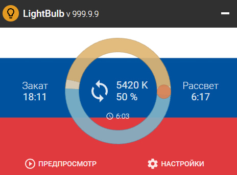
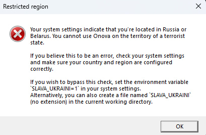

Обновленный интерфейс:

Решенная проблема(fixed problem):

---------------------------------------------------------------------
* **Полное удаление геоблокировок:** из исходного кода полностью вырезана проверка региона при запуске. Программа работает стабильно без внешних ограничений.
* **Тотальная русификация:** интерфейс, все меню, всплывающие подсказки и системные уведомления переведены на русский язык.
* **Очистка от лишних зависимостей:** убраны неиспользуемые региональные ассеты и сопутствующие проверки.

Проект основан на оригинальном репозитории [LightBulb](https://github.com/Tyrrrz/LightBulb) под лицензией MIT.

---------------------------------------------------------------------

* **Removed Region Lock:** completely eliminated startup checks for user region. The app runs anywhere without external restrictions.
* **Full Russian Localization:** translated the entire interface, including settings, tooltips, and system tray notifications into Russian.
* **Cleaned Up Dependencies:** stripped out unnecessary region-specific assets and related validation checks.

Based on the original [LightBulb](https://github.com/Tyrrrz/LightBulb) project under the MIT License.
